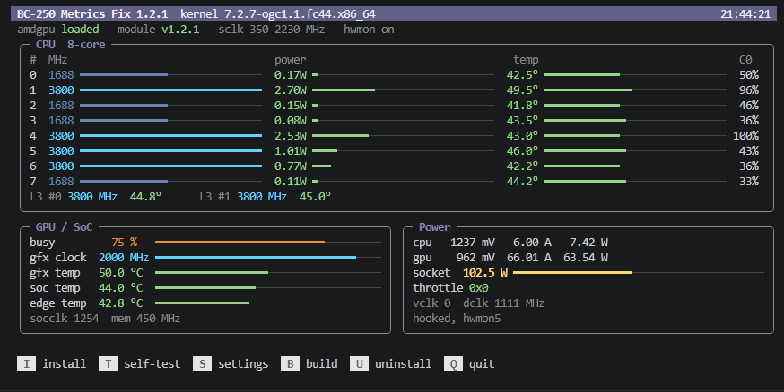

# BC-250 Bazzite Metrics Fix


Correct SMU telemetry for the AMD BC-250 on Bazzite with the
[AMD BC-250 UEFI v2.2](https://github.com/Forbidden-Darkness/AMD-BC-250-UEFI-v2.2-Firmware-Menu-Script) BIOS,
for those who want to see every metric the board reports, correct and in
the standard format.

## Problem

This BIOS unlocks all eight cores and carries an SMU firmware patch that
widens every per-core array of the metrics table. Stock `amdgpu` still
reads the table with the six-core layout, so almost every reading comes from
the wrong field: the GPU clock reads 4150 MHz, the GFX rail 5.9 V, the GPU
temperature is really the L3 cache, and MangoHud shows 655 % GPU load.

## Solution

A small kernel module loaded next to the stock `amdgpu`. It reads the
metrics table with the layout the firmware actually uses, so the standard
interfaces report correct values:

| Where | What is shown correctly |
|---|---|
| `sensors`, CoolerControl, KDE (`amdgpu` hwmon) | GPU clock, GFX and CPU rail voltage, package power, GPU temperature |
| MangoHud, amdgpu_top (`gpu_metrics`) | GPU load, clock, temperature and power; CPU power; clock, temperature and power of every core; L3 |
| radeontop | GPU and memory clock |
| LACT, CoreCtrl, governors (`pp_dpm_*`, `pp_od_clk_voltage`) | current GPU clock and voltage, range 350-2230 MHz |
| `gpu_busy_percent` | GPU load |

`amdgpu` and the kernel stay unchanged. Uninstalling restores stock
behaviour without a reboot. If the driver is already fixed, the module
steps aside.

## Usage

```sh
./bc250-metrics-fix.sh
```

Opens a live dashboard: `I` install / update, `T` self-test, `S` settings,
`U` uninstall, `Q` quit.



After a kernel update, run install again; until then readings are stock.

Without a terminal: `sudo ./bc250-metrics-fix.sh --install`, `--uninstall`,
`--status`, `--selftest`; see `--help`.

## Settings

| Setting | Default | |
|---|---|---|
| `sclk` | `extended` | GPU clock range 350-2230 MHz, or `stock` 1000-2000 MHz |
| `hwmon` | `off` | `on` adds a `bc250` sensor device with every reading: all cores, L3, both rails |

## With cyan-skillfish-governor

- `set-method = "kernel"` is recommended: clock and voltage then go through
  `pp_od_clk_voltage` (350-2230 MHz) and the driver's SMU lock. With
  `"smu"` the governor shares the driver's SMU mailbox without that lock,
  so their messages can collide.
- `fix-metrics = false`, `fix-freq = false`: the module already fixes
  `gpu_metrics` and the GPU clock, and the governor's overlays would hide
  the fixed files.
- `method = "kernel"` works: `gpu_busy_percent` is averaged over about
  250 ms. `busy-flag` reacts faster to short bursts.
- Thermal throttling reads the GFX temperature; stock `amdgpu` gives the L3
  cache temperature there.

## Requirements

- Bazzite on an OGC kernel.
- The [AMD BC-250 UEFI v2.2](https://github.com/Forbidden-Darkness/AMD-BC-250-UEFI-v2.2-Firmware-Menu-Script) BIOS with the SMU metrics patch (eight
  cores), or a stock BIOS (six cores). Eight cores without the patch are not
  supported.

## Credits

Eight-core field offsets come from `metrics-8core.s` in
[bc250-smu-unlock](https://github.com/rw-r-r-0644/bc250-smu-unlock).
